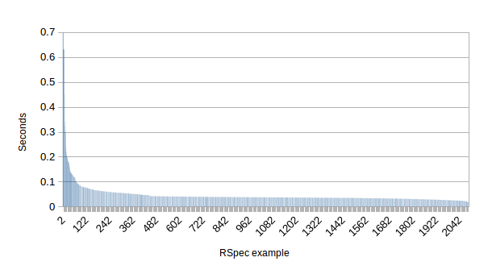

# Speeding up RSpec in `ascent-web`
## On the hunt for slow tests

Looking at `release-3.3.0` as of 7 July (`2294c08`), it takes about **2m21s to run RSpec in its entirety**.  Let's take
a few measurements.  Is one layer of the application slower than the rest? 

- 228 controller tests: 11.1s
- 329 gateway tests: 17.3s
- 280 interactor tests: 12.3s
- Everything else: **~1m40s**

Gateways tend to be slower, but not so slow that they're a significant impact on the overall runtime.  Profiling all
2278 examples (`rspec --profile 2278`) shows that are only a few examples are significantly slower than the rest:



The problem isn't that _some_ of the tests are slow; **all of the tests are slow.**

### It's got to be Rails...right?

RSpec listed `./spec/lib/batches/batch_filter_spec.rb:35` as fastest example at 0.017 seconds.  However, if you run that
file by itself (`time bundle exec rspec spec/lib/batches/batch_filter_spec.rb`) it will take **~11.6s** to run.

_What's up with that?_

The tests that `requie 'spec_helper'` are the ones that incur this large penalty.  I had a couple of ideas that were
dead ends:

1. _Stop auto-loading so much code_: Look at `spec_helper` and `config/application.rb`, and you'll see Rails autoloading
   all code, even if you're just running one test in isolation.  Disabling this for the test environment breaks a bunch
   of tests, and it turns out that 
   [Rails autoloading is complicated](http://urbanautomaton.com/blog/2013/08/27/rails-autoloading-hell/).
2. _Trim `$LOAD_PATH` down to a reasonable size_: We're adding directories _and subdirectories recursively_ to
   `$LOAD_PATH`, which shouldn't really be necessary.  I fixed that and adjusted the `require` statements that were off,
   but that didn't improve the startup penalty any.

However it turns out **this isn't much of a factor when running the whole test suite**.  If you run two test files that
require `spec_helper` in the same instance of RSpec, the process time is about the same as with one test. 

[Spork](https://github.com/sporkrb/spork), [Zeus](https://github.com/burke/zeus) and
[Spin](https://github.com/jstorimer/spin) exist to ease this burden by pre-loading Rails, but they add some
configuration burden and can lead to incorrect test results if you're not careful.

So I set this particular problem aside and focused on the total runtime.  

### Profiling helpers

So if Rails isn't slowing down all the tests, what is?  

Let's profile the test fixtures that are set up in the various `xyz_helper.rb` files with `Before` and `After` hooks
(see [Benchmark](http://www.ruby-doc.org/stdlib-1.9.3/libdoc/benchmark/rdoc/Benchmark.html)).  If you measure the time
spent in each hook method and group by the file it came from, you get something like this:

- `app_config_spec_helper`: 0.603s
- `capybara`: 0.119s
- `fabrication_spec_helper`: 0.231s
- `mongoid_spec_helper`: **48.98s**
- `rspec-rails`: 0s
- `spec_helper`: 2.6s

`mongoid_spec_helper` runs a total of **1595 times**, taking 0.031 seconds each time it runs.  Running all tests that
need `mongoid_spec_helper` yields **0.046s per example**, vs. **0.013s per example** for those that do not need to
access Mongo.  The extra 0.03s per test really adds up. 

So now we have a lead for what's taking so long.

## Testing with Mongo
### Keeping test databases in memory

Databases used in small tests are usually pretty small, and spinning up an external database can be a pain.  Some
databases offer a [memory-only mode](http://hsqldb.org/doc/guide/ch01.html#N101CA) when you can't (or don't want to)
break the dependency on the database.

I did some searching for ways to get MongoDB to run this way, and I didn't find anything quite like that.  You can,
however, run `mongodb` in a RAM disk ([download more](http://www.downloadmoreram.com/) if you're running low) and get a
reasonable performance improvement.  My tests ran **28% faster** when I did the following:

```sh
$ mount -o size=1G -t tmpfs none /mnt/tmpfs
$ mongod --smallfiles --noprealloc --nojournal --dbpath /mnt/tmpfs
```

This however, became unnecessary with the next finding.

### Something that works even better: `Mongoid.purge!`

We've been using `DatabaseCleaner`, which only supports the `:truncate` method.  Mongoid offers a [faster
way](https://github.com/mongoid/mongoid/blob/master/lib/mongoid/config.rb#L166) to clear out the database before each
test.

In case anyone is running RSpec in development or production environments (i.e.  `RAILS_ENV=development bundle exec
rspec`), purging is limited to just the test environment.  Note that tests requiring `mongoid_spec_helper` default to
the test environment.  You don't have to do anything special to get fast performance.

When you do this, you only spend **8.9s** in `mongoid_spec_helper` over the life of the test suite.

```ruby 
# spec/mongoid_spec_helper.rb
ENV['RAILS_ENV'] ||= 'test'
...
RSpec.configure do |config|
  #Retain pre-test data in development/production environments; purge in test to maintain cleanliness and to run faster
  if ENV['RAILS_ENV'] == 'test'
    config.before(:each) { Mongoid.purge! }
  else
    require 'database_cleaner'
    config.before(:suite) do
      DatabaseCleaner.strategy = :truncation
      DatabaseCleaner.orm = "mongoid"
    end
    config.before(:each) { DatabaseCleaner.clean }
  end
end
```

Going for the win and using `Mongoid.purge!` with a RAMdisk'd `mongodb` didn't do any better than just using
`Mongoid.purge!` by itself, so it wasn't worth the trouble of changing how the service starts up.

## Redirecting output

I noticed RSpec running faster when I redirected its output.  The `progress` formatter seems to flush `$stdout` for each
dot.

Running `bundle exec rspec --out <file> ...` does the trick, but it also makes you go through another stop of looking at
the file when you want to see results.  I created `script/rspec` to automate this process

If all specs pass, you'll see the summary:

```sh
ascent-web$ ./script/rspec spec/lib/assay_configuration/lots/lot_gateway_spec.rb 
RSpec output being saved to tmp/rspec.txt
Finished in 0.48446 seconds
38 examples, 0 failures
```

If any specs fail, you'll see the whole output:

```sh
ascent-web$ ./script/rspec spec/lib/assay_configuration/lots/lot_gateway_spec.rb
RSpec output being saved to tmp/rspec.txt
rspec ./spec/lib/assay_configuration/lots/lot_gateway_spec.rb:439 # LotGateway#update given an ID for an existing assay given a Lot with #compounds overwrites Lot#compounds with UpdateLotRequestEntity#compounds
rspec ./spec/lib/assay_configuration/lots/lot_gateway_spec.rb:442 # LotGateway#update given an ID for an existing assay given a Lot with #compounds returns LotEntity#compounds as [LotCompoundEntity ...]
```

We could also try [Fuubar](https://github.com/thekompanee/fuubar#installation) to get a progress bar, while maintaining
the increased speed.

## Results

At the end of the day, here are the improvements that I applied.

| Changes | Process time | RSpec time |
| :----   | ----:        | ----:      |
| None | 2m21s | 2m11s |
| Redirect output | 1m59s | 1m41s |
| Redirection + `Mongoid.purge!` | 1m3s | 45s |

Overall, that's a **55% improvement**.

### Thoughts ahead: Mongo

At the time of this writing, we had **1330 examples that load `mongoid_spec_helper`**.  That's more tests relying on
Mongo than not, despite there being only have a handful (23) of gateway classes that directly interact with Mongo.

If your code _doesn't_ directly interact with Mongo, consider breaking the dependency on Mongo by mocking out the
gateway classes that interact with Mongo.  This can be good for both the tests and the production code.

### Thoughts ahead: Rails 

If you have slow tests that `require 'spec_helper'` and want to reduce that 10s+ startup penalty;

- Your test may not need to load Rails.  Other, more specific helpers exist in `spec/` such as
  `spec/user_spec_helper.rb`.
- Your test may not need any helpers at all.  There were a few tests that `require 'spec_helper'` unnecessarily.
- If your production code does depend directly on Rails, consider separating your logic from Rails and testing it
  separately.
